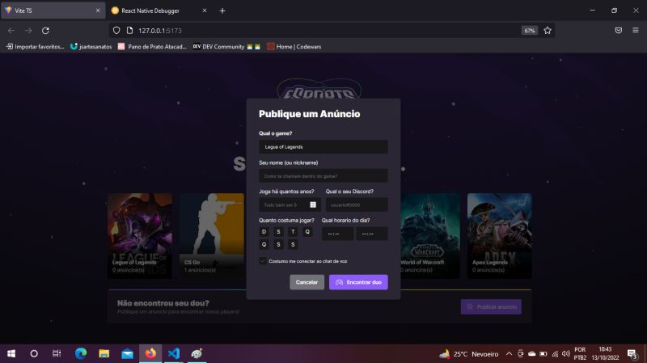
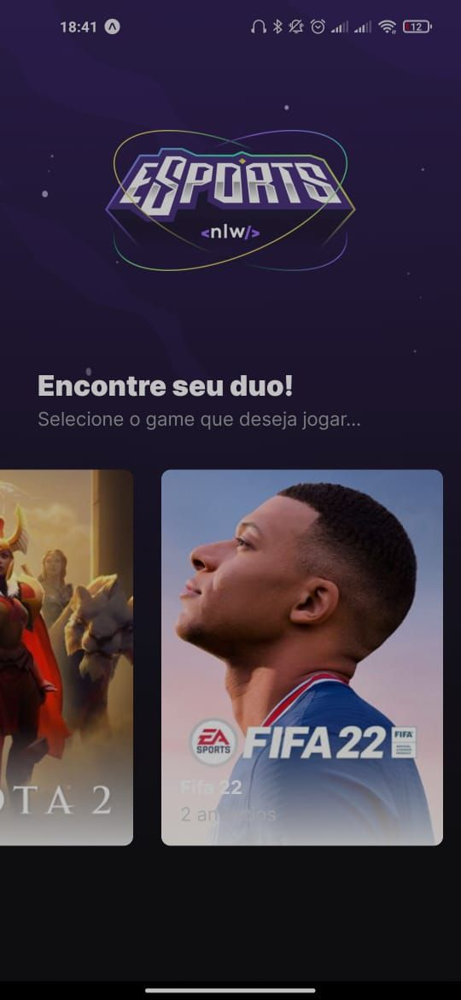
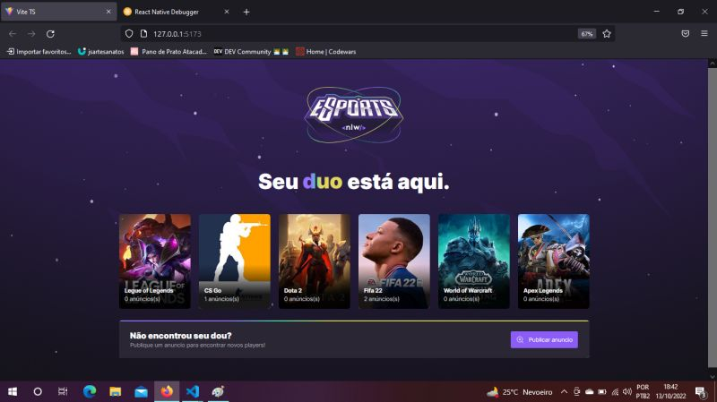

<h1 align="center">E-sports</h1>

O objetivo da aplicação é ajudar jogadores a encontrarem novos parceiros se conectando através do Discord

## 💻 Sobre o projeto

 E-Sports - é uma forma de conectar jogadores atraves do discord.

Projeto desenvolvido durante a **NLW - Next Level Week** oferecida pela [Rocketseat](https://blog.rocketseat.com.br/primeira-next-level-week/).
O NLW é uma experiência online com muito conteúdo prático, desafios e hacks onde o conteúdo fica disponível durante uma semana.

---

## 🎨 Layout

### Mobile

  

  

### Web

  

  

### 🛠 Tecnologias

As seguintes tecnologias foram usadas na construção do projeto:

- [Node.js](https://nodejs.org/en/)
- [React](https://pt-br.reactjs.org/)
- [React Native](https://reactnative.dev/)
- [TypeScript](https://www.typescriptlang.org/)

### Autor
---
 
  
 <b>Kevin Silva</b> 🚀

Feito por Kevin Silva 👋🏽 Entre em contato!

 

